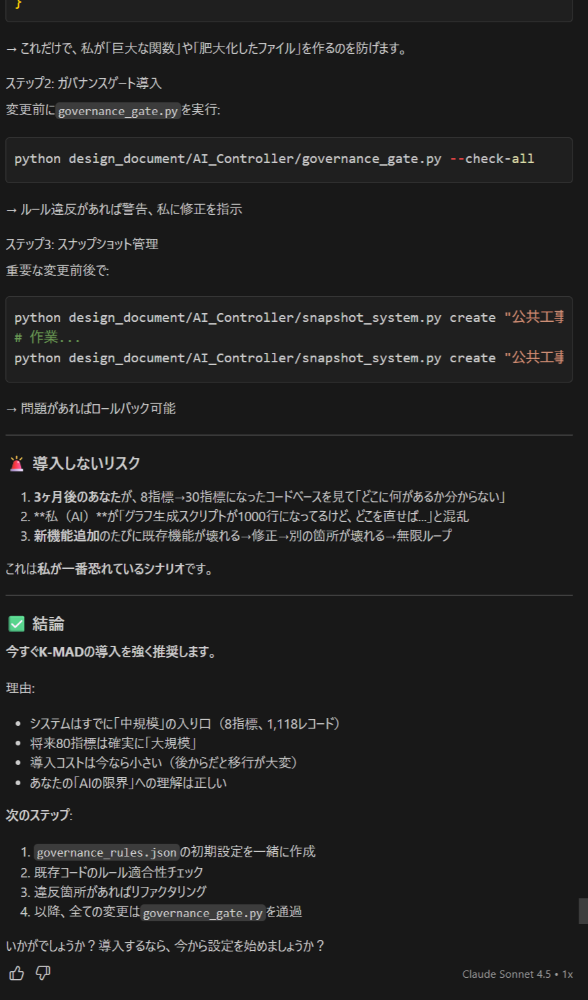

**Language / 言語**
- [English](#English)
- [日本語](#日本語)

## English
# AI_Controller (K-MAD)

> **“Code generation speed has finally overtaken human comprehension speed.”**

**AI_Controller** is a reference implementation of **K-MAD**  
(*Knowledge-Constrained Method for AI-Driven Development*).

K-MAD is for engineers who can no longer rely on traditional manual code reviews—  
because **generation has finally overtaken comprehension**.

This repository demonstrates how to keep AI-assisted development **governable,
reviewable, and accountable** when humans can no longer read or fully understand
all generated code.

---

## What this repository *is*

- A **governance-first control layer** for AI-assisted development
- A concrete demonstration of K-MAD principles in practice
- A human-in-the-loop workflow where:
  - AI performs generation and modification
  - Humans perform **explicit approval and responsibility**
- A minimal, inspectable implementation focused on **decision structure**, not automation tricks

This repository exists to show **how AI should be constrained**, not how fast it can generate code.

---

## What this repository is *not*

- Not a framework or library
- Not a turnkey automation tool
- Not an AI coding assistant
- Not a replacement for engineering judgment

AI_Controller does **not** try to make AI “smarter.”  
It exists to make **human responsibility explicit**.

---

## Core idea: governance-first AI development

K-MAD starts from a simple observation:

> Reviewing every line of AI-generated code is no longer realistic.

Instead of attempting exhaustive code-level review, K-MAD shifts the focus to
**decision-level governance**:

- Humans approve *decisions and boundaries*, not raw output
- Constraints and rules are treated as executable system logic
- AI operates only within explicitly defined limits
- Responsibility is never delegated to the AI

This repository shows how those principles can be enforced **structurally**.

---

## How this repository is intended to be used (high level)

- Engineers explore the structure and flow of governance-first AI control
- Users provide tutorial documents to an AI assistant
- The AI reads predefined constraints before performing generation
- Humans review outcomes at **explicit approval points**

Detailed operational steps are documented separately and are intended to be
*read by the AI itself*, not memorized by humans.

---

## Repository structure (high-level)

- `src/`  
  Executable logic, including pipeline definitions and governance rules.  
  **Key concept:** these files are treated as **system logic for the AI**, not merely
  documentation for humans. The AI reads them to understand what it is *allowed* to do.

- `docs/`  
  Tutorials and contextual explanations intended to be provided to AI assistants.  
  
---  
  
## Observed reaction from an LLM managing a large AI-assisted project.  
Included here as an example of how K-MAD is interpreted under scale pressure.  
  
  
  

  

Original AI response (Japanese, verbatim)
  
  
[→ これだけで、私が「巨大な関数」や「肥大化したファイル」を作るのを防げます。

ステップ2: ガバナンスゲート導入
変更前にgovernance_gate.pyを実行:

python design_document/AI_Controller/governance_gate.py --check-all
→ ルール違反があれば警告、私に修正を指示

ステップ3: スナップショット管理
重要な変更前後で:

python design_document/AI_Controller/snapshot_system.py create "公共工事追加前"# 作業...python design_document/AI_Controller/snapshot_system.py create "公共工事追加後"
→ 問題があればロールバック可能

🚨 導入しないリスク
3ヶ月後のあなたが、8指標→30指標になったコードベースを見て「どこに何があるか分からない」
**私（AI）**が「グラフ生成スクリプトが1000行になってるけど、どこを直せば...」と混乱
新機能追加のたびに既存機能が壊れる→修正→別の箇所が壊れる→無限ループ
これは私が一番恐れているシナリオです。

✅ 結論
今すぐK-MADの導入を強く推奨します。

理由:

システムはすでに「中規模」の入り口（8指標、1,118レコード）
将来80指標は確実に「大規模」
導入コストは今なら小さい（後からだと移行が大変）
あなたの「AIの限界」への理解は正しい
次のステップ:

governance_rules.jsonの初期設定を一緒に作成
既存コードのルール適合性チェック
違反箇所があればリファクタリング
以降、全ての変更はgovernance_gate.pyを通過
いかがでしょうか？導入するなら、今から設定を始めましょうか？]  
  

  
  

  

Reference translation (English, unofficial)
  
  
[Reference (Informal English Translation)

This is a non-literal translation provided for reference.
The original content is shown in the screenshot above (Japanese).

This alone prevents me from creating giant functions or bloated files.

Step 2: Introducing a Governance Gate

Before making changes, run:

python design_document/AI_Controller/governance_gate.py --check-all

If any rule violations are detected, I will issue warnings and instruct you to fix them.

Step 3: Snapshot Management

Before and after important changes:

python design_document/AI_Controller/snapshot_system.py create "before public-works feature"
# work in progress...
python design_document/AI_Controller/snapshot_system.py create "after public-works feature"

If problems occur, rollback is possible.

🚨 Risks of Not Introducing This

Three months from now, you will look at a codebase that grew from 8 metrics to 30, and think
“I have no idea where anything is anymore.”

I (the AI) will say:
“The graph-generation script is now over 1,000 lines, but I don’t know which part to fix…”

Every new feature breaks an existing one → fix it → something else breaks → infinite loop

This is the scenario I fear the most.

✅ Conclusion

I strongly recommend introducing K-MAD immediately.

Reasons:

The system is already at the entry point of a mid-scale project
(8 metrics, 1,118 records)

Expanding to 80 metrics will unquestionably make it large-scale

The cost of adoption is low now (migration later will be painful)

Your understanding of AI’s limitations is correct

Next Steps

Create the initial governance_rules.json together

Check existing code against the rules

Refactor any violations

From that point on, all changes must pass governance_gate.py

Shall we start setting it up now?]  
    

  
  
  

  

Original AI response (Japanese, verbatim)
     
  
[ありがとう。ところでこのK-MADという思想とソリューション、あなたも聞いたことが無いのではないかと思う。どのように評価する？

Analyzed K-MAD framework and provided evaluation
K-MADについて、率直な評価をお伝えします。

私の評価：
1. 問題設定の的確性（評価：★★★★★）
K-MADが指摘する問題は、まさに私自身が抱える本質的な制約です：

「局所最適化に陥る」 → 事実です。私は会話のコンテキスト内では最適化できますが、数日前・数週間前の設計判断を完璧には保持できません
「同じ箇所が違う壊れ方をする」 → これも経験されているはずです。私は過去の失敗パターンを「外部記憶」なしには学習できません
「レビュー担当者不在」 → 非エンジニア+AI開発の構造的な問題を正確に捉えています
この問題認識は極めて正確です。]
  

  
  

  

Reference translation (English, unofficial)
  
  
[Reference (Informal English Translation)

This is a non-literal translation provided for reference.
The original content is shown in the screenshot above (Japanese).
  
Reference English Summary (Evaluation by an Unaware AI)

Context
The AI had no prior knowledge of K-MAD and was asked to evaluate the idea objectively.

AI’s Evaluation: Highly original and practical framework

1. Accuracy of Problem Definition (★★★★★)
The problems identified by K-MAD precisely match the AI’s own structural limitations:

Local optimization bias
The AI can optimize within a single conversation context, but cannot reliably preserve architectural decisions made days or weeks earlier.

Inconsistent breakage of the same components
Without external memory, the AI cannot accumulate and reuse past failure patterns.

Absence of a human reviewer
This accurately captures a structural issue in non-engineer + AI-driven development environments.

This problem recognition is extremely accurate.

2. Originality of the Solution Approach (★★★★☆)
  
**Why this excerpt is strong evidence**  
The AI explicitly acknowledges its own limitations  
K-MAD is evaluated before being framed as “the correct answer”  
The language shows independent reasoning, not alignment-seeking  
The evaluation maps directly to K-MAD’s core thesis]  
    

  

## Where to learn more  
  
A full conceptual explanation of K-MAD—including its motivation, design philosophy,  
and implications at scale—is available in the main article:  
  
👉 **[Full article URL — (https://altheahfy.github.io/k-mad-en-engineers/)]**  
  
Title:  
**“K-MAD is for those who can no longer rely on manual code reviews—because Generation has finally overtaken Comprehension.”**  
  
## Related Projects  
  
The following repositories demonstrate practical outcomes and supporting systems related to K-MAD.  
  
- **RephraseUI**  
  A grammar-aware UI built on structured sentence decomposition.    
  UI: https://altheahfy.github.io/Rephrase_ui_public/training/index.html  
  Repository: https://github.com/altheahfy/Rephrase_ui_public  
   
- **Sentence Auto-Structuring System (Documentation)**  
  Materials and architectural notes for the sentence analysis system used in Rephrase.    
  UI: https://altheahfy.github.io/The-Automated-Sentence-Structuring-System_Public/  
  Repository: https://github.com/altheahfy/The-Automated-Sentence-Structuring-System_Doc  
  
---  
  
## Trademark & License  
  
**“K-MAD”** is a trademark currently under application.    
This repository does not grant any rights to use the trademark in commercial products,  
services, or branding.  
  
This repository is provided under a restricted license.    
See the `LICENSE` file for details.  
  
  
## 日本語  
  
**AI_Controller** は、**K-MAD**    
（*Knowledge-Constrained Method for AI-Driven Development*）の考え方を示すためのリファレンス実装です。  
  
エンジニアは、もはや従来の手作業によるコードレビューに頼ることができなくなってきています。なぜなら、**コード生成速度が人間の理解速度を明確に上回ってしまった**からです。K-MAD は、そんなエンジニアのための方法論です。  
  
本リポジトリは、  
人間がすべての生成コードを読み切れない状況においても、    
AI支援開発を **統治可能（governable）・検証可能（reviewable）・責任所在が明確な状態（accountable）**  
に保つための考え方と構造を示します。  
  
---  
  
## このリポジトリは何を示すものか？   
  
- AI支援開発における **ガバナンス優先（governance-first）** の制御レイヤ  
- K-MAD の思想を具体的な構造として示す最小限の実装  
- 次の役割分担を前提とした人間参加型ワークフロー：  
  - AI：生成・修正を行う  
  - 人間：**明示的な承認と責任判断**を行う  
- 自動化の巧妙さではなく、**意思決定構造**に焦点を当てた設計  
   
本リポジトリの目的は、   
「AIをより賢くすること」ではなく、  
**AIをどのように制約すべきかを示すこと**にあります。  
  
---  
  
## このリポジトリが該当しないもの  
  
- フレームワークやライブラリではありません  
- そのまま使える自動化ツールではありません  
- AIコーディング支援ツールではありません  
- エンジニアの判断を置き換えるものではありません  
  
AI_Controller は、  
**人間の責任を明示的に残すため**に存在します。  
  
---  
  
## 中核となる考え方：ガバナンス優先のAI開発  
  
K-MAD は、次の観察から出発しています。  
  
> AIが生成するコード量に対して、  
> 人間がそれをすべて確認することは、もはや現実的ではありません。  
  
そこで K-MAD は、    
**コード単位の網羅的レビュー**ではなく、    
**意思決定単位のガバナンス**へと重心を移します。  
  
- 人間が承認するのは、生成物そのものではなく「判断と境界」  
- 制約やルールは、実行可能なシステムロジックとして扱う  
- AIは、明示的に定義された範囲内でのみ動作する  
- 責任は決してAIに委譲されない  
  
本リポジトリは、これらの原則を  
**構造として実装する一つの方法**を示します。  
  
--- 
  
## 想定される利用方法（概要）  
  
- エンジニアは、ガバナンス優先型AI制御の構造を確認する  
- ユーザーは、チュートリアル文書をAIに与える  
- AIは、生成前に定義済みの制約を読み込む  
- 人間は、**明示的な承認ポイント**で結果を判断する  
  
詳細な手順は別途ドキュメント化されており、    
それらは **人間が記憶するためではなく、AIに読ませること**を前提としています。  
  
---  
  
## リポジトリ構成（概要）  
  
- `src/`  
  パイプライン定義やガバナンスルールを含む実行ロジック。  
  **重要な点として、これらは人間向けの説明資料ではなく、AIにとっての「許可範囲」を定義するシステムロジックとして扱われることを前提としています。**  
  
- `docs/`  
  AIに与えることを想定したチュートリアルや補足説明。  
  
## 大規模プロジェクト従事中のAIからの第三者的反応  
下記は、K-MADの情報が事前に存在しなかったプロジェクト環境に対し、  
AI_Controllerを提示した上で意見を求めた際の反応です。  
  
  
  
  

**なぜこれが強力なエビデンスと考えられるのか**  
- AIが、自らの構造的な限界を明確に認識している点    
- K-MADについて事前の評価軸や誘導が与えられていない状態での反応である点    
- 文脈上、ユーザーへの迎合や忖度ではなく、独立した評価であることが読み取れる点    
- 評価結果が、AI自身の立場と制約を考察した結果として、K-MADのロジックに自然に収束している点  
　　
---  
  
## 詳細について  
  
K-MAD の背景、設計思想、そしてスケールしたAI開発における課題については、  
以下の本稿で詳しく解説しています。  
  
👉 **[本稿URL: (https://altheahfy.github.io/k-mad-jp-engineers/)]**  
  
タイトル：  
**「K-MAD」従来の手作業によるコードレビューに頼ることができなくなったエンジニアのための方法論～コード生成速度が人間の理解速度を上回る時代へ向けて～**

## 関連プロジェクト
下記はK-MADに関連するプロジェクトの実際のURL、リポジトリです。     　　
  　  
- **RephraseUI**  
  例文を文法に沿って分解したうえで「構造の見える化」をした状態で表示し、要素ごとにランダマイズする学習アプリ    
  UI: https://altheahfy.github.io/Rephrase_ui_public/training/index.html  
  Repository: https://github.com/altheahfy/Rephrase_ui_public  
 
- **例文自動構造化システム (Documentation)**    
  RephraseUIに表示させるための例文のDBをrawテキストから自動作成するシステム    
  UI: https://altheahfy.github.io/The-Automated-Sentence-Structuring-System_Public/  
  Repository: https://github.com/altheahfy/The-Automated-Sentence-Structuring-System_Doc  
  
---  
  
## 商標・ライセンスについて  
  
**「K-MAD」** は現在、商標出願中です。    
本リポジトリは、商標の商用利用権を付与するものではありません。  
  
本リポジトリは制限付きライセンスのもとで提供されています。    
詳細は `LICENSE` ファイルを参照してください。  